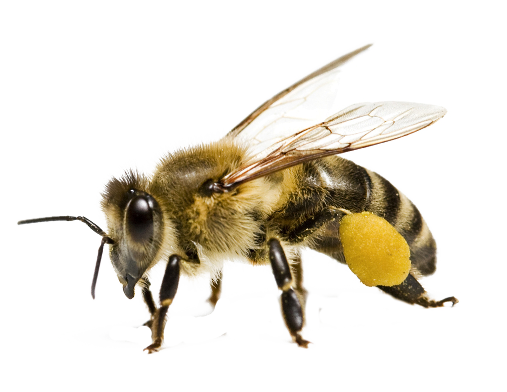

# AGENTS.md

## Project Overview

Alberta Bee Adventure — interactive educational web app for grades 1-6 about beekeeping in Alberta, Canada. Built with React 19, TypeScript, Vite, Tailwind CSS 4. Fully offline with no external API dependencies.

## Commands

- `npm run dev` — start dev server on port 3000
- `npm run build` — production build (outputs to `dist/`)
- `npm run lint` — TypeScript typecheck (`tsc --noEmit`)
- No test framework is currently set up

## Coding Conventions

### Image Paths — Always Use Relative Paths

The app is hosted on GitHub Pages at a subpath (`/alberta-bee-adventure/`). Vite is configured with `base: './'`, so all asset paths must be **relative** to work correctly on both localhost and the deployed subpath.

**Correct:**
```tsx

<link rel="manifest" href="./manifest.json" />
```

**Wrong:**
```tsx

<link rel="manifest" href="/manifest.json" />
```

Absolute paths (starting with `/`) resolve to the domain root, skipping the `/alberta-bee-adventure/` subpath, so assets will 404 on GitHub Pages. This applies to all hand-written `src` and `href` attributes in JSX and HTML — Vite only rewrites paths for assets processed through `import` or CSS.

### Component Structure

- Each section is a standalone component in `src/components/`
- Components receive an `onNext` callback for navigation to the next section
- Fact/feature data is defined as typed arrays at the top of each component
- Images live in `public/images/` organized by section
- Every section is wrapped in `<ErrorBoundary>` with a `remountKey` for state reset

### Section Flow

The app is a single-page scroll layout. Sections render in this order:

1. `Home` — welcome/start screen
2. `BeeLifecycle` — egg → larva → pupa → worker
3. `BeeTypes` — queen, workers, drone
4. `WaggleDance` — communication dance with YouTube embed
5. `BeeOrWasp` — comparison table (bee vs wasp)
6. `AlbertaStats` — Alberta beekeeping facts
7. `AlbertaFlora` — flowers bees pollinate
8. `AlbertaSeasons` — beekeeping through the year
9. `AlbertaBeekeeperProfiles` — fictional keeper profiles
10. `AlbertaChallengesSolutions` — threats and solutions
11. `AlbertaWinter` — winter survival (final section, `onNext` resets to home)

### Navigation

- Fixed top nav bar with tabs for each section, using `IntersectionObserver` to highlight the active section
- Keyboard navigation: `j`/`ArrowDown` = next section, `k`/`ArrowUp` = previous section, `Home` = reset, `End` = last section
- Scroll progress bar using Framer Motion `useSpring`
- Scroll-to-top button appears after scrolling past 200px

### Styling

- Neo-brutalist design: bold borders (`border-4 border-black`), hard shadows (`shadow-[4px_4px_0px_0px_rgba(0,0,0,1)]`), bright colors
- Tailwind utility classes only — custom CSS is minimal and defined in `src/index.css`
- lucide-react for icons
- motion (Framer Motion) for animations and transitions

#### Custom CSS Classes (defined in `src/index.css`)

| Class | Purpose |
| --- | --- |
| `brutalist-card` | Static card with border, shadow |
| `brutalist-card-clickable` | Interactive card with hover/active shadow animation |
| `heading-bold` | `font-black uppercase tracking-tighter` |

#### Custom Theme Colors (defined in `src/index.css`)

| Variable | Color | Tailwind class |
| --- | --- | --- |
| `--color-bee-sky` | `#f0f9ff` | `bg-bee-sky`, `text-bee-sky` |
| `--color-bee-yellow` | `#fbbf24` | `bg-bee-yellow`, `text-bee-yellow` |
| `--color-bee-green` | `#10b981` | `bg-bee-green`, `text-bee-green` |
| `--color-bee-rose` | `#fb7185` | `bg-bee-rose`, `text-bee-rose` |

### GitHub Credentials

This project uses a GitHub token for deployment. Credentials are stored globally in `~/.git-credentials` and git is configured to use them automatically for all repos.

```bash
# Check current credentials
git config --global --list

# For new repos, add remote and push
git remote add origin https://github.com/curtis-winter/your-repo.git
git push -u origin master
```

## Deployment

- GitHub Actions workflow (`.github/workflows/deploy.yml`) builds and deploys to GitHub Pages
- GitHub Pages `build_type` must be set to `workflow` (not `legacy`/`/docs`)
- Pushes to `master` trigger automatic deploys
- Workflow also supports `workflow_dispatch` for manual triggers
- The `public/` directory should only contain static assets (images, manifest.json) — never build artifacts
